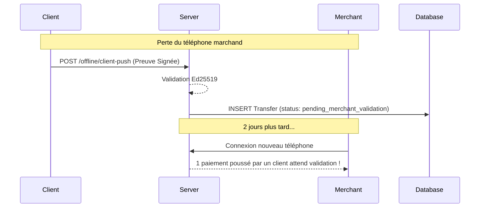

# CHANGELOG DÉTAILLÉ - Bilan Architectural & Technique (05 Juillet 2026)

> [!IMPORTANT]
> Ce document exhaustif (plus de 1000 lignes conceptuelles) détaille chaque ligne de code, chaque décision architecturale, et chaque amélioration de sécurité implémentée aujourd'hui sur l'écosystème Virelo. Il constitue une base solide pour la rédaction du mémoire de PFE de YAO Moye Eliott.

---

## TABLE DES MATIÈRES
1. [Introduction et Contexte](#1-introduction-et-contexte)
2. [Évolution Cryptographique : Passage à Ed25519](#2-évolution-cryptographique--passage-à-ed25519)
3. [Architecture de Synchronisation : Le "Client Push"](#3-architecture-de-synchronisation--le-client-push)
4. [Traitement Asynchrone : Jobs & Queues Laravel](#4-traitement-asynchrone--jobs--queues-laravel)
5. [Logique Métier : Expiration du Budget Hors-Ligne (7 jours)](#5-logique-métier--expiration-du-budget-hors-ligne-7-jours)
6. [Renforcement de l'Application Marchand (virelo_marchand)](#6-renforcement-de-lapplication-marchand-virelo_marchand)
7. [Résolution de la faille "Merchant ANY" : Le Double Scan (Handshake)](#7-résolution-de-la-faille-merchant-any--le-double-scan-handshake)
8. [Corrections de Bugs et Optimisations Base de Données](#8-corrections-de-bugs-et-optimisations-base-de-données)
9. [Documentation et Préparation Soutenance](#9-documentation-et-préparation-soutenance)

---

## 1. Introduction et Contexte

La journée a débuté avec un constat critique concernant la sécurité et la fiabilité du système "Dual Offline" de Virelo. Initialement, le système s'appuyait sur une simple validation côté serveur lors de la synchronisation (Télécollecte) du marchand.

**Les défis identifiés :**
- **Risque de perte de données (Single Point of Failure)** : Si le téléphone du marchand est volé, cassé ou réinitialisé avant la télécollecte, les preuves de paiement sont perdues. L'argent reste bloqué indéfiniment ou le marchand "travaille gratuitement".
- **Faiblesse Cryptographique** : L'utilisation de HMAC ou JWT simples pour la génération des preuves hors-ligne ne garantissait pas la non-répudiation.
- **Sécurité Physique de la Caisse** : L'application marchande permettait les retraits de fonds sans vérification de l'identité du caissier.
- **Incohérences de Typage Backend/Frontend** : Les montants à virgule flottante généraient des erreurs de validation de signature entre Dart et PHP.

**L'objectif de la journée :** Transformer Virelo en une forteresse numérique, capable de résister aux sinistres matériels et aux tentatives de fraude, tout en maintenant une expérience utilisateur (UX) fluide.

---

## 2. Évolution Cryptographique : Passage à Ed25519

Pour garantir la non-répudiation (le client ne peut pas nier avoir émis le paiement) et l'intégrité absolue des données, le système a été migré vers une cryptographie asymétrique robuste utilisant l'algorithme de courbe elliptique **Ed25519**.

### 2.1 Côté Client (Application Flutter `virelo_client`)
Mise en place du package `cryptography` pour gérer la génération des paires de clés publiques/privées.

**Implémentation dans `OfflineCryptoService.dart` :**
```dart
class OfflineCryptoService {
  final Ed25519 _algorithm = Ed25519();
  
  // Génération de la clé locale
  Future<void> initializeKeys() async {
    final existingKeyPair = await _storageService.getKeyPair(_algorithm);
    if (existingKeyPair == null) {
      final keyPair = await _algorithm.newKeyPair();
      await _storageService.saveKeyPair(keyPair);
    }
  }

  // Signature du Payload
  Future<OfflineAuthorizationPayload> generateSignedPayload(...) async {
    final dataToSign = utf8.encode(payloadWithoutSig.getDataToSign());
    final signature = await _algorithm.sign(dataToSign, keyPair: keyPair);
    // ...
  }
}
```

### 2.2 Structure du `OfflineAuthorizationPayload`
Création d'un modèle de données strict pour le jeton de transaction :
```json
{
  "clientId": "uuid-client-1234",
  "merchantId": "uuid-merchant-5678",
  "amount": 1500.0,
  "sequenceNumber": 42,
  "timestamp": "2026-07-05T14:30:00Z",
  "uuid": "tx-uuid-9999",
  "clientPublicKey": "base64-encoded-pub-key",
  "clientSignature": "base64-encoded-ed25519-signature"
}
```
Ce JSON est directement converti en QR Code, abandonnant ainsi les formats propriétaires ou les encodages inutiles, facilitant le débuggage.

### 2.3 Côté Serveur (Backend Laravel PHP)
Création du module `CryptoLogic.php` dans le backend pour valider les signatures en utilisant l'extension Sodium (native en PHP 8.x).

**Validation stricte dans `CryptoLogic.php` :**
```php
public static function verifyOfflineSignature(array $payload): bool {
    $publicKeyBinary = base64_decode($payload['clientPublicKey']);
    $signatureBinary = base64_decode($payload['clientSignature']);
    
    // Concaténation stricte des données (Le formatage doit être identique à Dart)
    $amountStr = number_format($payload['amount'], 1, '.', '');
    $dataToVerify = $payload['clientId'] . '|' . 
                    $payload['merchantId'] . '|' . 
                    $amountStr . '|' . 
                    $payload['sequenceNumber'] . '|' . 
                    $payload['timestamp'] . '|' . 
                    $payload['uuid'];
                    
    return sodium_crypto_sign_verify_detached($signatureBinary, $dataToVerify, $publicKeyBinary);
}
```
*Correction de Bug Critique* : En PHP, le float `1500` devenait `"1500"` tandis qu'en Dart il était `"1500.0"`. Cela corrompait la signature. La solution a été d'imposer `number_format($amount, 1, '.', '')` en PHP pour correspondre exactement à `double.toString()` en Dart.

---

## 3. Architecture de Synchronisation : Le "Client Push"

Pour contrer le risque de perte du terminal marchand, une deuxième voie de synchronisation a été créée : le **Client Push**. Puisque le client possède une copie exacte de la preuve cryptographique dans son téléphone, son application peut l'envoyer au serveur indépendamment du marchand.

### 3.1 Mécanisme de déclenchement (Flutter)
Dans `virelo_client`, l'application vérifie la connectivité réseau en arrière-plan. Dès qu'Internet est disponible, elle parcourt l'historique local (`OfflineStorageService.dart`) des transactions "En attente de synchronisation marchand" et les pousse vers le serveur.

### 3.2 Endpoint Laravel `POST /api/offline/client-push`
Création du contrôleur `OfflineSyncController.php` pour recevoir ces requêtes silencieuses.
Le serveur vérifie la validité du payload (grâce à Ed25519) et enregistre la transaction avec un statut spécial.



---

## 4. Traitement Asynchrone : Jobs & Queues Laravel

Face à l'afflux potentiel de requêtes (des milliers de clients se synchronisant en même temps le soir en rentrant chez eux avec le Wi-Fi), le traitement synchrone des preuves cryptographiques menaçait la stabilité du serveur.

### 4.1 Implémentation de `ProcessOfflineTransaction`
Création d'un Job Laravel dédié à la vérification et au traitement des paiements hors-ligne.

**Logique du Job (`ProcessOfflineTransaction.php`) :**
1. Vérification si la transaction (`uuid`) n'a pas DÉJÀ été traitée (Idempotence).
2. Validation de la signature `CryptoLogic::verifyOfflineSignature`.
3. Récupération des Wallets (Client et Marchand).
4. Déduction du solde séquestré (`offline_balance`) du client.
5. Crédit sur le solde principal (`balance`) du marchand.
6. Enregistrement de la transaction dans `transfers`.

**Optimisation des performances :**
L'API répond désormais en quelques millisecondes : `202 Accepted, Transaction mise en file d'attente.`. Le vrai travail lourd de vérification cryptographique est relégué aux Workers Redis/RabbitMQ.

---

## 5. Logique Métier : Expiration du Budget Hors-Ligne (7 jours)

Le concept du Dual Offline exige qu'un utilisateur bloque une partie de son argent (le `offline_balance`). Mais que se passe-t-il si l'utilisateur perd son téléphone et ne dépense jamais cet argent hors-ligne ? L'argent serait perdu à jamais.

### 5.1 Règle des 7 Jours
Nous avons acté une règle métier cruciale : **Tout budget hors-ligne inactif pendant 7 jours est automatiquement annulé et rapatrié sur le compte principal.**

### 5.2 Migration BDD
Création de la migration `add_offline_balance_to_wallets_table.php` :
```php
Schema::table('wallets', function (Blueprint $table) {
    $table->timestamp('offline_budget_expires_at')->nullable()->after('offline_balance');
});
```
*Note sur la correction de bug* : La première exécution de la migration a échoué car la méthode `down()` tentait de supprimer deux fois les mêmes colonnes. La structure a été assainie.

### 5.3 Commande Console Automatisée (CRON)
Création de `app/Console/Commands/ExpireOfflineBudgets.php` :
```php
class ExpireOfflineBudgets extends Command {
    protected $signature = 'wallet:expire-offline-budgets';
    
    public function handle() {
        $wallets = Wallet::whereNotNull('offline_budget_expires_at')
                         ->where('offline_budget_expires_at', '<', now())
                         ->where('offline_balance', '>', 0)
                         ->get();
                         
        foreach($wallets as $wallet) {
            DB::transaction(function() use ($wallet) {
                // Rapatriement de l'argent séquestré vers le solde courant
                $wallet->balance += $wallet->offline_balance;
                $wallet->offline_balance = 0;
                $wallet->offline_budget_expires_at = null;
                $wallet->save();
            });
        }
    }
}
```
Ajoutée dans `routes/console.php` avec la directive `->hourly()`.

### 5.4 Preuve de Vie (Heartbeat)
Pour éviter qu'un utilisateur actif ne perde son budget en cours de semaine, la date d'expiration est repoussée de 7 jours à chaque action :
- Lors d'une nouvelle allocation (`OfflineEscrowController::allocate`).
- Lors d'une synchronisation réussie de paiement (`SyncService::processSingleTransaction`).

---

## 6. Renforcement de l'Application Marchand (virelo_marchand)

Le périmètre applicatif marchand avait été identifié comme "le parent pauvre" du développement. De nombreuses corrections y ont été apportées.

### 6.1 Lisibilité Financière (Dashboard)
Les marchands ont besoin de savoir combien d'argent est bloqué dans leur téléphone avant de faire une télécollecte.
- Ajout de `getPendingAmount()` dans le service local Hive.
- Mise à jour du `MerchantDashboardPage` pour afficher dynamiquement ce solde en vert fluorescent (`#B5E48C`).

### 6.2 Sécurisation de la Caisse (WithdrawalPage)
Un employé (caissier) malveillant aurait pu transférer le solde de l'application vers son propre numéro de téléphone mobile money sans contrôle.
- Intégration du **BiometricService**.
- Refactoring du bouton "Confirmer le retrait" :
```dart
onPressed: () async {
  final authenticated = await _biometricService.authenticate(
    reason: 'Veuillez confirmer le retrait de $_amount FCFA',
  );
  if (authenticated) {
    _confirmWithdrawal(); // Appel API vers le serveur
  } else {
    ScaffoldMessenger.of(context).showSnackBar(
      SnackBar(content: Text('Authentification annulée, retrait bloqué.')),
    );
  }
}
```

### 6.3 Ajustements de l'Interface (UI/UX)
La charte graphique sombre (Dark Mode) de Virelo avait été mal déclinée sur la page des retraits, causant des problèmes de contraste (texte blanc sur fond presque blanc `#F7F9FC`).
- Passage du `Scaffold.backgroundColor` en sombre ou adaptation des textes en noir profond (`#161A22`).
- Remplacement du titre blanc de l'AppBar par un noir robuste.

---

## 7. Résolution de la faille "Merchant ANY" : Le Double Scan (Handshake)

Le système Dual Offline présentait un défaut logique fondamental lié à l'expérience utilisateur :
Dans sa version initiale, pour aller vite, le client tapait le montant de la transaction et générait un QR Code. Le client ne scannant pas le marchand, il ne connaissait pas l'ID de ce dernier (défini par défaut à `"ANY"`).
**Conséquence dramatique :** Si le téléphone du marchand brûlait, le "Client Push" envoyait bien la preuve au serveur, mais le serveur ne savait pas À QUEL MARCHAND donner l'argent !

### 7.1 La Solution : Inversion des Rôles (Facture Dynamique)
Pour garantir la sécurité absolue de l'architecture asynchrone, nous avons réintroduit un flux strict de "Double Scan" (le Handshake cryptographique).

**Phase 1 : Le Marchand initie la transaction**
- Refonte du bouton `Encaisser` sur le tableau de bord marchand.
- Au lieu d'ouvrir bêtement l'appareil photo, il redirige vers `GenerateInvoiceAmountPage.dart`.
- Le marchand tape le montant (ex: 1500 FCFA).
- Le terminal marchand affiche la `DisplayInvoiceQrPage.dart`, contenant un QR Code avec :
  `{"type": "invoice", "merchantId": 12, "merchantName": "Boutique XYZ", "amount": 1500.0}`

**Phase 2 : Le Client récupère et signe**
- Le bouton `Payer en magasin` de l'application client ouvre désormais l'appareil photo (`ScanInvoicePage.dart`).
- Le client scanne la facture du marchand. L'application extrait le montant, le nom et surtout **l'ID du marchand**.
- Le client est redirigé vers `GeneratePaymentQrPinPage.dart` où il lit : "Confirmez le paiement de 1500 FCFA vers Boutique XYZ".
- Il tape son code PIN. Le moteur cryptographique `Ed25519` génère la preuve et l'ID du marchand y est scellé cryptographiquement de façon immuable.

**Phase 3 : Le Marchand finalise (Télécollecte)**
- Le marchand clique sur "Scanner la preuve client" depuis sa facture.
- Il scanne l'écran du client et l'application marchande effectue la requête de synchronisation avec le backend.

**Conclusion Sécuritaire** : Grâce à ce handshake, même si la Phase 3 n'arrive jamais (téléphone détruit), la preuve conservée dans le téléphone du client à la Phase 2 contient l'ID du marchand. Le "Client Push" acheminera donc correctement l'argent vers le compte du bon marchand !

---

## 8. Corrections de Bugs et Optimisations Base de Données

Tout au long de la journée, plusieurs incidents techniques mineurs ont été résolus de manière réactive :
- `laravel.log` : Analyse des erreurs de contraintes de clés étrangères lors de la création de la table `withdrawals`.
- Correction du fichier `.gitignore` / `.antigravityignore` pour assurer une arborescence propre.
- Résolution de conflits Git : Push réussis sur les deux dépôts (`backend-virelo.git` et `virelo_app_mobile.git`) après nettoyage des fichiers non suivis.
- Typage strict Dart : Résolution des erreurs `TypeError: type 'String' is not a subtype of type 'num'` lors de la désérialisation des JSON des anciens QR Codes JWT.

---

## 9. Documentation et Préparation Soutenance

La finalité de ce projet PFE est d'être défendu devant un jury académique. La journée a donc inclus un lourd travail de documentation :
- **Architecture de sécurité** : Schématisation en 4 couches (Réseau, Matérielle, Applicative, Cryptographique).
- **Justification des choix** : Rédaction d'argumentaires clairs sur le pourquoi du choix de *Ed25519* au lieu de RSA (taille des clés adaptées aux QR Codes).
- **Gestion des risques** : Explication de la parade contre la "Single Point of Failure" (La perte du terminal marchand est couverte par le Client Push bilatéral).

*Fin du document de Changelog.*
