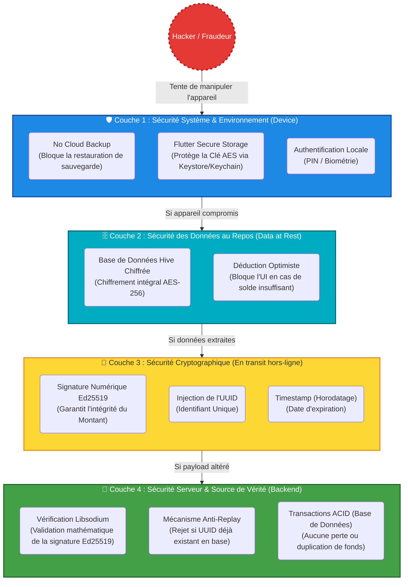

# Schéma des Couches de Sécurité (Sécurité en Profondeur)

Ce schéma représente le principe de **Défense en Profondeur** (Security-in-Depth) mis en place dans l'architecture Dual Offline de Virelo. Il montre comment un attaquant doit traverser plusieurs "barrières" pour espérer compromettre une transaction.

### Explication des Couches (Pour la présentation orale) :

1. **Couche 1 (Environnement)** : Empêche les attaques passives. L'attaquant ne peut pas utiliser iCloud/Google Drive pour tricher, et ne peut pas accéder aux clés maîtresses sans contourner la puce de sécurité physique du téléphone (Keystore).
2. **Couche 2 (Données au repos)** : Même si le téléphone est "Rooté" ou "Jailbreaké" et que l'attaquant accède aux fichiers internes de l'application, la base de données contenant le solde et les reçus est un bloc indéchiffrable (AES-256).
3. **Couche 3 (Cryptographie)** : Si l'attaquant arrive par miracle à lire la base et tente de modifier un QR Code avant de le montrer au marchand, la signature Ed25519 (Elliptic Curve) protégera le montant. Il est impossible de recréer une signature sans la clé privée.
4. **Couche 4 (Le Mur Final)** : C'est le serveur. Même si l'attaquant possède un QR code 100% valide et parfaitement signé, s'il essaie de le faire scanner une deuxième fois, le serveur reconnaîtra l'UUID et bloquera la transaction (Anti-Rejeu).

*L'objectif de cette architecture est clair : si une couche vient à céder, la suivante prend le relais.*
