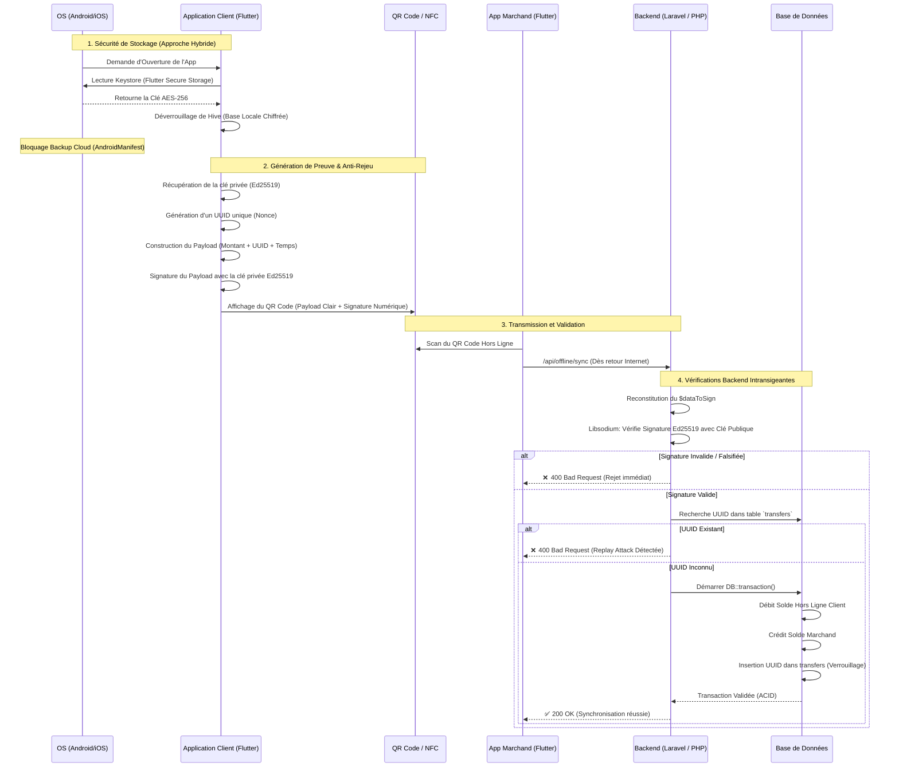

# Schéma de l'Architecture de Sécurité Dual Offline

Voici le diagramme d'architecture qui modélise l'ensemble des systèmes de sécurité mis en place pour Virelo. Tu pourras directement inclure ce diagramme dans ton mémoire de PFE !

### Comment lire ce schéma ?

Ce diagramme séquentiel se décompose en 4 zones de sécurité :
1. **Sécurité de Stockage (Hybride)** : L'OS mobile fournit la clé matérielle qui déverrouille le coffre-fort local Hive, tout en interdisant le clonage vers le Cloud.
2. **Génération (Anti-Rejeu)** : L'application forge le reçu de transaction et lui attache une signature infalsifiable (Ed25519) ainsi qu'un "Numéro de série" unique (UUID).
3. **Transmission** : Le QR code transporte la promesse de débit sans qu'aucune connectivité réseau ne soit requise entre le client et le marchand.
4. **Le Juge (Backend)** : Le serveur Laravel ne fait confiance à personne. Il vérifie les mathématiques (Libsodium), vérifie ses registres (Anti-Rejeu), et applique un mouvement de fonds atomique.
